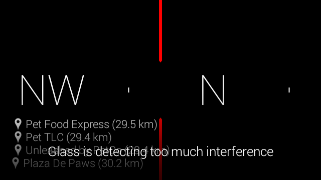
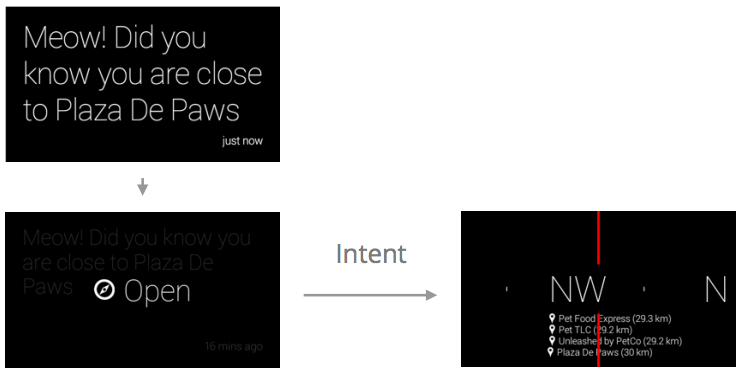

# Warning: This sample is deprecated. It last worked as of XE12.
That being said, a pull request to fix it would be welcome :)

Kitty Compass
=======
A hybrid Glassware Sample created for the 
[Hybrid Glassware session](http://tsn2.bzmedia.com/tradeshows/classinfo.aspx?id=19480&showid=31) 
at [Wearables DevCon](http://www.wearablesdevcon.com/) 2014

This Glassware is a cat themed mash-up of the [gdk-compass-sample](/googleglass/gdk-compass-sample) 
and the [mirror-java-quickstart](/googleglass/mirror-java-quickstart), which it uses to provide coarse location updates. 

This is not an official sample. In other words, it's not actively
maintained. It last worked as of XE12.

## Usage
This is a bit of an advanced Glassware, so I'll skip over the easy stuff. 
If these instructions are confusing, try out some of the 
[awesome](/googleglass/gdk-compass-sample) [official](/googleglass/gdk-level-sample) 
[samples](/googleglass/gdk-waveform-sample) first.

1. Import the gdk directory into Android Studio (last tested with 0.5.1)
2. Import the mirror directory into your favorite IDE that can import from a Maven `pom.xml` file
3. Run the Mirror Glassware
4. Install and run the GDK Glassware

## Learn More
Check out the
[official documentation](https://developers.google.com/glass/develop/index)
to learn how to develop for Glass.
